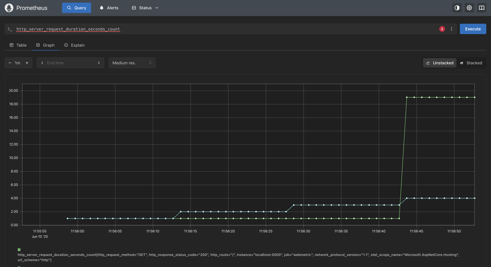
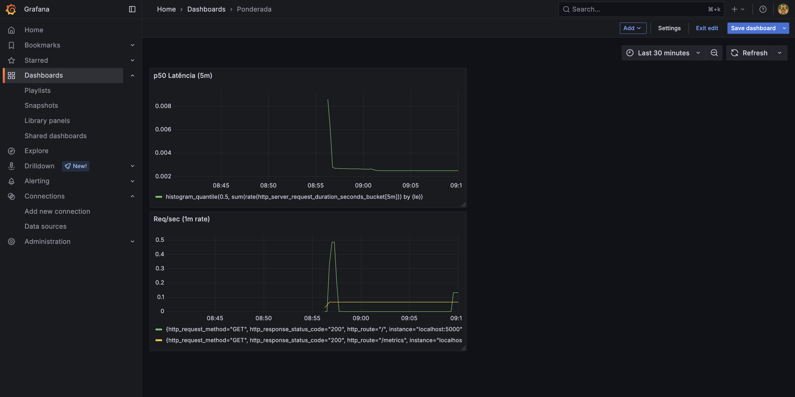

# Autostudo Metrics

Este repositório demonstra como instrumentar um aplicativo ASP.NET Core, expor métricas via Prometheus e visualizar dados no Grafana. Siga o passo-a-passo abaixo para reproduzir todo o setup.

## Pré-requisitos

- [.NET 8 SDK](https://dotnet.microsoft.com/download)  
- [Homebrew](https://brew.sh/)  


## 1. Criar o projeto ASP.NET Core

No terminal, execute:

```bash
dotnet new web -o WebMetric
cd WebMetric
```

Isso gera um projeto minimal com `Program.cs` e `WebMetric.csproj`.

## 2. Instrumentação com OpenTelemetry e exportador Prometheus
I. Instale os pacotes necessários:

   ```bash
   dotnet add package OpenTelemetry.Exporter.Prometheus.AspNetCore --prerelease
   dotnet add package OpenTelemetry.Extensions.Hosting
   ```

II. Substitua o conteúdo de **Program.cs** por:

   ```csharp
   using OpenTelemetry.Metrics;

   var builder = WebApplication.CreateBuilder(args);

   builder.Services.AddOpenTelemetry()
     .WithMetrics(metrics =>
     {
       metrics.AddPrometheusExporter();
       metrics.AddMeter(
         "Microsoft.AspNetCore.Hosting",
         "Microsoft.AspNetCore.Server.Kestrel");
       metrics.AddView("http.server.request.duration",
         new ExplicitBucketHistogramConfiguration
         {
           Boundaries = new double[] {
             0, 0.005, 0.01, 0.025, 0.05,
             0.075, 0.1, 0.25, 0.5, 0.75,
             1, 2.5, 5, 7.5, 10
           }
         });
     });

   var app = builder.Build();

   app.MapPrometheusScrapingEndpoint();
   app.MapGet("/", () =>
     "Hello OpenTelemetry! ticks:" + DateTime.Now.Ticks.ToString()[^3..]);

   app.Run();
   ```

   Baseado em: [https://learn.microsoft.com/pt-br/aspnet/core/log-mon/metrics/metrics?view=aspnetcore-8.0](https://learn.microsoft.com/pt-br/aspnet/core/log-mon/metrics/metrics?view=aspnetcore-8.0)

## 3. Teste das métricas localmente

I. Inicie o aplicativo:

   ```bash
   dotnet run --project WebMetric
   ```

II. Em outro terminal, verifique o endpoint Prometheus:

   ```bash
   curl http://localhost:5000/metrics
   ```

   Você deverá ver várias métricas, por exemplo:

   ```
   # HELP http_server_request_duration_seconds Duration of HTTP server requests.
   # TYPE http_server_request_duration_seconds histogram
   http_server_request_duration_seconds_bucket{…} 1
   …
   ```

## 4. Configuração do Prometheus

I. Instale o Prometheus:

   ```bash
   brew install prometheus
   ```

II. Crie na raiz do repositório um arquivo `prometheus.yml`:

   ```yaml
   global:
     scrape_interval: 15s

   scrape_configs:
     - job_name: "webmetric"
       metrics_path: /metrics
       static_configs:
         - targets: ["localhost:5000"]
   ```

III. Inicie o Prometheus:

   ```bash
   prometheus --config.file=prometheus.yml
   ```

IV. Acesse `http://localhost:9090`, vá em **Graph** e execute:

   ```
   http_server_request_duration_seconds_count
   ```

   Gere tráfego com:

   ```bash
   curl http://localhost:5000/
   curl http://localhost:5000/
   ```


## 5. Instalação e configuração do Grafana

I. Instale e inicie o Grafana:

   ```bash
   brew install grafana
   brew services start grafana
   ```

II. Abra `http://localhost:3000` (login `admin`/`admin`).

III. Em **Configuration > Data Sources**, adicione **Prometheus** com URL `http://localhost:9090` e teste a conexão.

## 6. Criação do Dashboard no Grafana

I. No Grafana, clique em **Create > Dashboard**.

II. **Painel “Req/sec (1m rate)”**

   * Data Source: Prometheus
   * Query:

     ```promql
     rate(http_server_request_duration_seconds_count[1m])
     ```
   * Salve o painel.

III. **Painel “p50 Latência (5m)”**

   * Data Source: Prometheus
   * Query:

     ```promql
     histogram_quantile(
       0.5,
       sum(rate(http_server_request_duration_seconds_bucket[5m])) by (le)
     )
     ```
   * Salve o painel.

IV. Salve o dashboard como **WebMetric Dashboard**.

   

---

## 7. Exportar dashboard para controle de versão

No dashboard, clique em **Share > Export > Save to file** e salve como:

```
grafana/webmetric-dashboard.json
```

## 8. Estrutura final do repositório

```
autostudo-metrics/
├── WebMetric/                     
│   ├── Program.cs                 
│   └── WebMetric.csproj          
├── prometheus.yml                 
├── grafana/
│   └── webmetric-dashboard.json   
└── docs/
    └── images/
        ├── prometheus-graph.png   
        └── grafana-dashboard.png  
```